# 🚀 AWS EC2 Nginx Website Deployment

A beginner-friendly DevOps project demonstrating how to launch an Ubuntu EC2 instance on AWS, configure networking, install and manage the Nginx web server, deploy a custom HTML website, and maintain the project using Git & GitHub.

---

# ☁️ Complete AWS EC2 Deployment Architecture

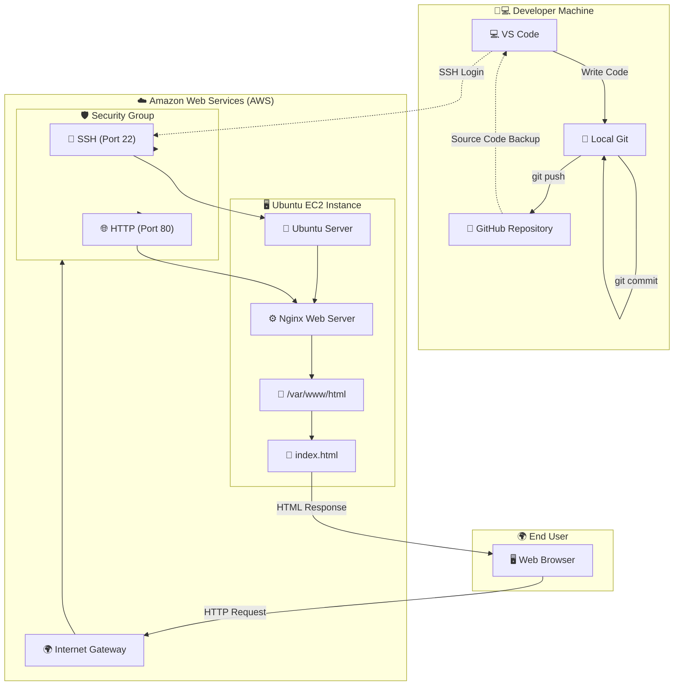

---

# 🚀 Deployment Workflow

```mermaid
flowchart LR

A["📝 Create index.html"]

-->B["📂 Initialize Git"]

-->C["📤 Push Code to GitHub"]

-->D["☁️ Launch AWS EC2"]

-->E["🔐 Connect using SSH"]

-->F["📦 sudo apt update"]

-->G["⚙️ Install Nginx"]

-->H["📄 Replace Default index.html"]

-->I["🔄 Restart Nginx"]

-->J["🌐 Access Website via Public IP"]

-->K["✅ Website Live"]
```

---

# 🌐 Client Request Lifecycle

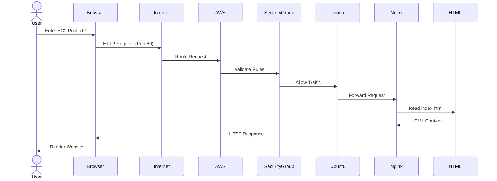

---

# 🔐 Network Architecture

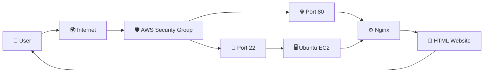

---

## 📌 Project Overview

This project covers the complete workflow of:

* Launching an Ubuntu EC2 Instance
* Configuring Security Groups
* Connecting through SSH
* Installing and managing Nginx
* Hosting a custom HTML website
* Uploading the project to GitHub with documentation

---

# 🛠️ Technology Stack

| Technology   | Purpose               |
| ------------ | --------------------- |
| AWS EC2      | Cloud Virtual Machine |
| Ubuntu Linux | Operating System      |
| Nginx        | Web Server            |
| Git          | Version Control       |
| GitHub       | Source Code Hosting   |
| HTML5        | Static Website        |

---

# 📂 Project Structure

```text
aws-ec2-nginx-website/
│
├── index.html
├── README.md
│
└── screenshot/
    ├── Ec2.png
    ├── sshconnect.png
    ├── aptupdate.png
    ├── installnginx.png
    ├── running-nginx.png
    ├── restartnginx.png
    ├── diskuses.png
    ├── memoryuses.png
    ├── runningprocess.png
    ├── htmlwebsitecmd.png
    ├── htmlpage.png
    └── websitenginx.png
```

---

# ✅ Task 1 — AWS EC2 Instance Setup

### Steps Performed

* Logged in to AWS Management Console
* Launched an Ubuntu EC2 Instance
* Created a Security Group
* Allowed inbound traffic:

  * SSH (Port 22)
  * HTTP (Port 80)
* Generated and downloaded the SSH Key Pair
* Connected securely using SSH

### SSH Command

```bash
ssh -i "intern-key.pem" ubuntu@<EC2_PUBLIC_IP>
```

---

## 📷 EC2 Dashboard

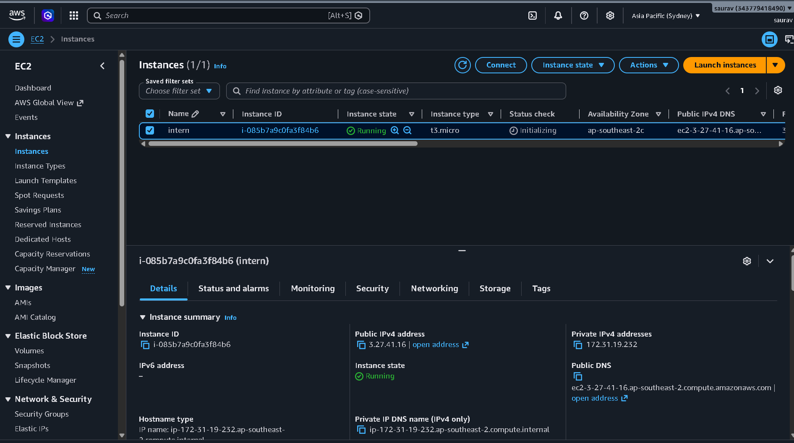

---

## 📷 SSH Login

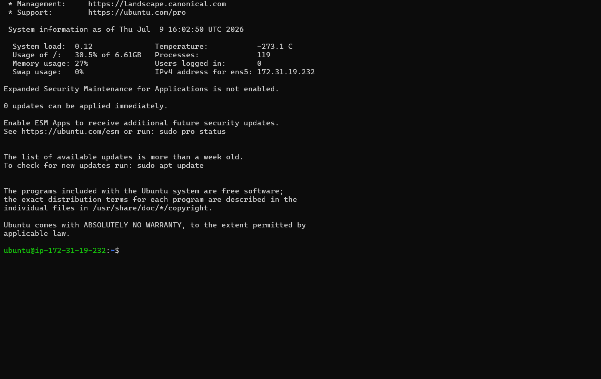

---

# ✅ Task 2 — Linux Basics & Nginx Installation

## Update Packages

```bash
sudo apt update
```

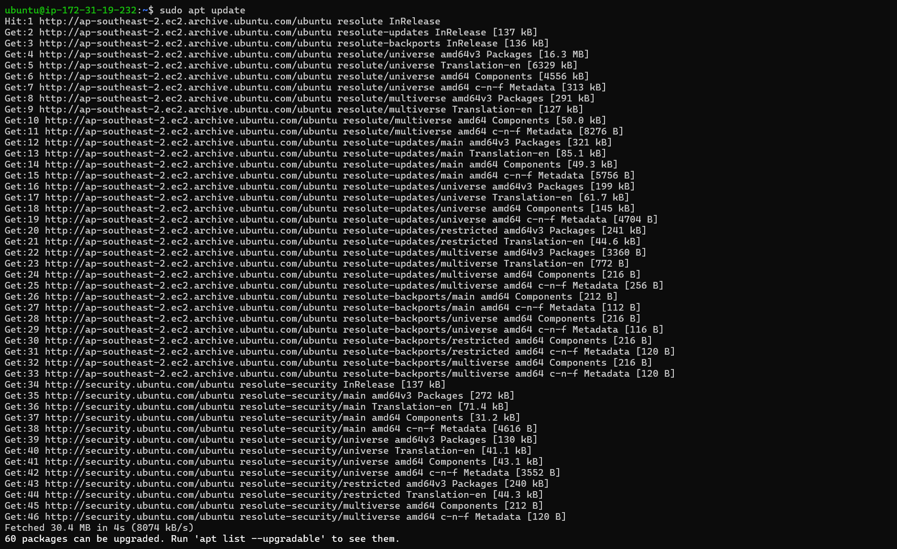

---

## Install Nginx

```bash
sudo apt install nginx -y
```

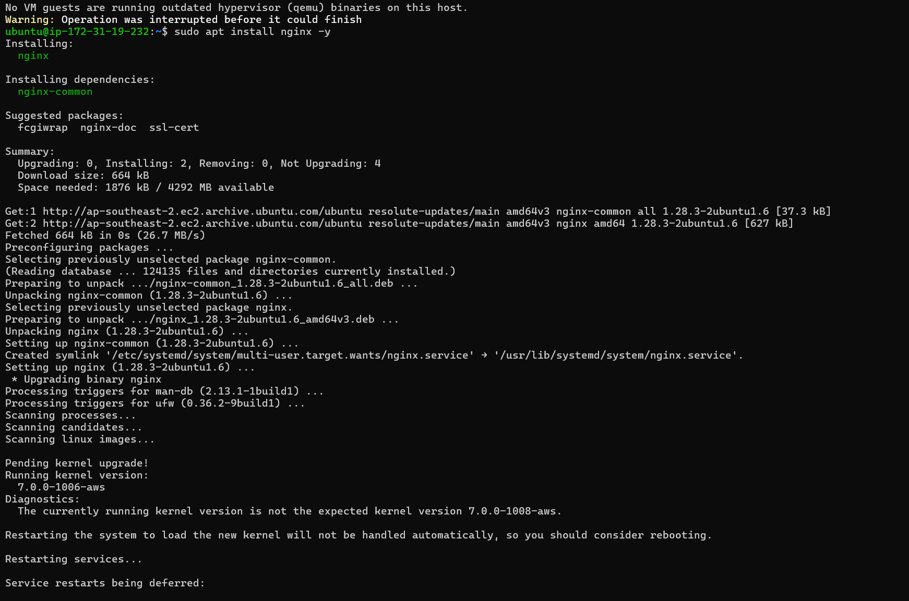

---

## Check Nginx Status

```bash
sudo systemctl status nginx
```

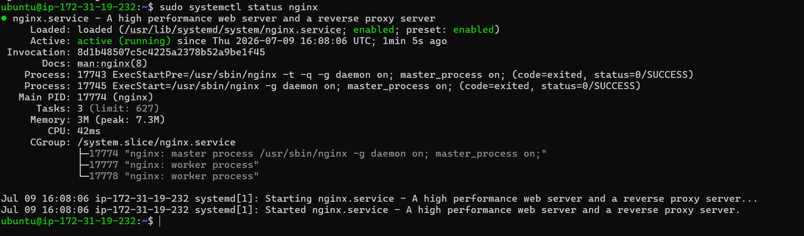

---

## Restart Nginx

```bash
sudo systemctl restart nginx
```

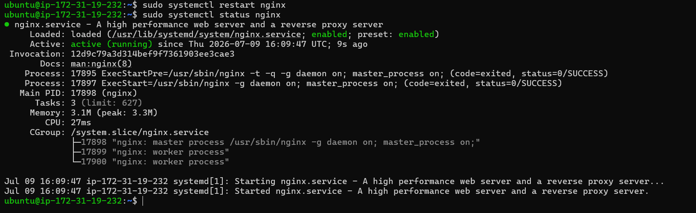

---

## Check Disk Usage

```bash
df -h
```

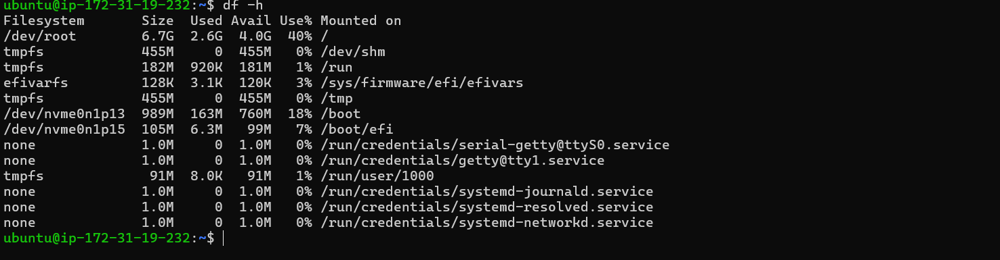

---

## Check Memory Usage

```bash
free -h
```

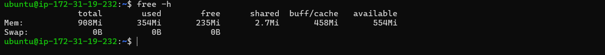

---

## Running Processes

```bash
ps -ef
```

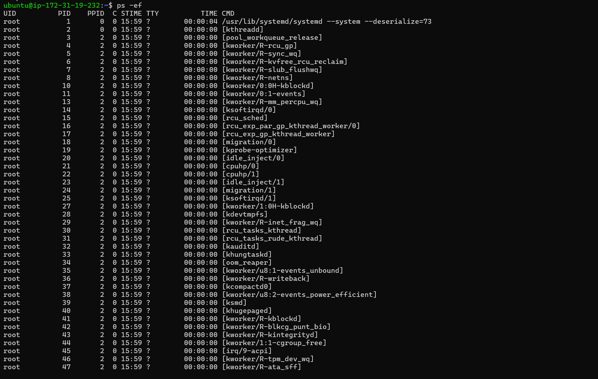

---

# ✅ Task 3 — Host a Simple Website

### Website Deployment Steps

* Created a custom `index.html`
* Added:

  * Name
  * College
  * Branch
  * Email
  * Current Date
* Replaced the default Nginx page
* Restarted the Nginx service
* Verified the deployment using the EC2 Public IP

---

## HTML Configuration

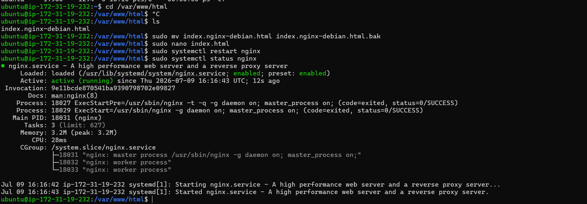

---

## HTML Source Code

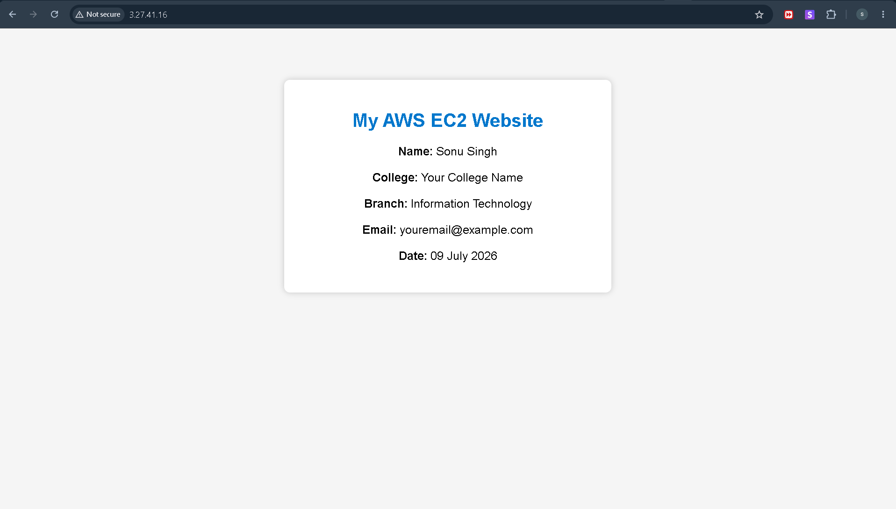

---

## 🌐 Live Website

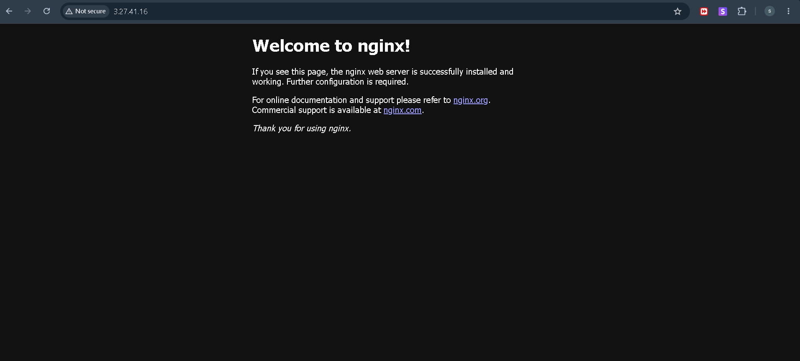

---

# ✅ Task 4 — Git & GitHub

The complete project has been uploaded to GitHub.

### Repository

**https://github.com/Saurav6200907210/aws-ec2-nginx-website**

---

# 💻 Commands Used

```bash
sudo apt update
sudo apt install nginx -y
sudo systemctl status nginx
sudo systemctl restart nginx
df -h
free -h
ps -ef
```

---

# 🎯 Learning Outcomes

Through this project, I learned how to:

* Launch and configure an AWS EC2 instance
* Configure Security Groups
* Connect to a Linux server using SSH
* Install and manage the Nginx web server
* Host a static website on AWS
* Work with essential Linux commands
* Use Git and GitHub for version control
* Document a deployment project professionally

---

# 👨💻 Author

**Gurajapu Vinay Teja**

**College:** Sathyabama University (Chennai)

**Branch:** CSE

**Email:** [Vinayteja8885@gmail.com](mailto:vinayteja8885@gmail.com)

**Deployment Date:** 09 July 2026

---

⭐ If you found this project useful, consider giving the repository a star.
